<p align="center">
  
</p>

<h1 align="center">Ditto</h1>

<p align="center">
  <i>가치관과 라이프스타일 기록을 기반으로 사용자를 연결하는 AI 매칭 SNS 플랫폼</i>
</p>

<p align="center">
  <a href="https://www.notion.so/1-Ditto-bd197cddd34783638bfa018174019d09">
    
  </a>
</p>


<p align="center">
  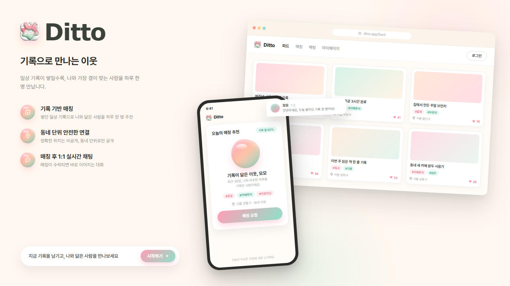
</p>

## ☕ 프로젝트 소개

Ditto는 스펙이나 외형 중심의 매칭이 아니라, 사용자가 직접 남긴 글과 관심사에서 드러나는 생활 방식과 가치관을 기반으로 연결을 만드는 서비스입니다.

- 사용자의 게시글과 프로필을 벡터화해 AI 기반 매칭 후보를 추천합니다.
- 매칭 이후에는 실시간 채팅과 알림으로 자연스럽게 대화를 이어갈 수 있습니다.
- 피드, 매칭, 채팅, 알림, 어시스턴트를 각각 독립 서비스로 분리해 장애 격리와 확장성을 고려했습니다.
- Kafka, Redis, MongoDB, PostgreSQL, pgvector를 도메인 특성에 맞게 조합했습니다.

## 👥 팀

| 팀원 | GitHub | 포지션 | 담당 |
| --- | --- | --- | --- |
| 강다연 | [](https://github.com/181108-cherry) | 팀원 | Chat Service: 메시지 전송 파이프라인, STOMP 에러 채널/핸드셰이크 인증, MongoDB 메시지 저장·조회, Kafka 알림 이벤트 발행, 그룹방 운영 |
| 김다은 | [](https://github.com/euneuneun) | 팀원 | Feed Service: 게시글/좋아요/댓글 피드, S3 업로드 검증, Outbox 이벤트 발행, 외부 I/O 격리 / Notification Service: Kafka 알림, SSE push, Retry/DLT |
| 박소윤 | [](https://github.com/musoyou12) | 팀원 | Match Service: AI 임베딩 기반 매칭, pgvector HNSW 검색, Redis 중복 요청 방지, RAG 매칭 이유 설명 |
| 박주원 | [](https://github.com/k-r-1) | 팀원 | Chat Service: 채팅방 생명주기, 읽음/Presence, 방 목록 N+1 개선, 메시지 전송 성능 튜닝, lastMessage·읽음 동시성 방어, user-service 검증 연동 |
| 손형호 | [](https://github.com/GolemOnce) | 개발리드 | User Service: 인증, Refresh Token, 프로필/팔로우/차단/신고, 내부 검증 API / CI/CD, 인프라, 배포 |
| 이선진 | [](https://github.com/Seonjin-13) | 팀원 | Embedding Service: 게시글 임베딩, 프로필 벡터 파이프라인, EMA/전체 재계산 배치, Retry/DLQ / Assistant Service: RAG 챗봇, 문서 인덱싱, LLM 전환 |

## ⭐ 주요 기능

| 영역 | 핵심 기능 |
| --- | --- |
| 👥 User Service | JWT Access/Refresh 인증, Redis Refresh Token 관리, 프로필/관심사/차단/신고, 계정 상태 관리 |
| 📸 Feed Service | 게시글/댓글/좋아요, 팔로잉/추천 피드, S3 Presigned URL 업로드 검증, Kakao 위치명 Redis 캐싱, Outbox 이벤트 발행, soft/hard delete |
| ❤️ Match Service | pgvector HNSW 기반 후보 검색, 일 1회 매칭, 차단/팔로잉 후보 제외, Redis 중복 요청 방지 |
| 🔢 Embedding Service | 게시글 텍스트 임베딩, Kafka 이벤트 구독, 유저 프로필 벡터 갱신, EMA/전체 재계산 배치 |
| 💬 Chat Service | 1:1/그룹 채팅방, STOMP 실시간 메시지, MongoDB 메시지 저장, Redis dedup/presence, unread Read Model |
| 🔔 Notification Service | Kafka 이벤트 소비, 알림 저장/중복 방지, SSE 실시간 알림, 재시도/DLT 분리 |
| 🤖 Assistant Service | FAQ/정책 문서 기반 RAG, pgvector 문서 검색, LLM 답변 생성, 질문/근거 로그 저장 |
| 🖥️ Web | React/Vite 기반 랜딩, 인증, 피드, 매칭, 채팅, 알림, 어시스턴트 UI |

## 🧩 서비스 구성

| 서비스 | 포트 | 역할 | 주요 저장소/인프라 |
| --- | ---: | --- | --- |
| api-gateway | 8080 | 인증 필터, 서비스 라우팅, WebSocket 라우팅 | Spring Cloud Gateway |
| user-service | 8081 | 인증, 사용자, 프로필, 차단, 신고 | PostgreSQL, Redis |
| feed-service | 8082 | 게시글, 댓글, 좋아요, 피드 | PostgreSQL, Redis, S3, Kafka |
| match-service | 8083 | 매칭, 추천 후보, 추천 근거 | PostgreSQL(pgvector), Redis, Kafka |
| chat-service | 8084 | 채팅방, 메시지, presence, unread | PostgreSQL, MongoDB, Redis, Kafka, STOMP |
| notification-service | 8085 | 알림 저장/조회, SSE push | PostgreSQL, Redis, Kafka |
| assistant-service | 8086 | RAG 어시스턴트 | PostgreSQL(pgvector), LLM API |
| embedding-service | 8090 | 임베딩 생성/동기화 | FastAPI, PostgreSQL(pgvector), Kafka |
| web | 5173 | 클라이언트 | React, Vite |

## 🏗️ 아키텍처

### 배포/인프라 구성도

> 브로셔 기준 인프라 구성도입니다. 서비스별 로컬 포트와 최신 실행 기준은 위의 [서비스 구성](#서비스-구성) 표를 기준으로 확인합니다.

<p align="center">
  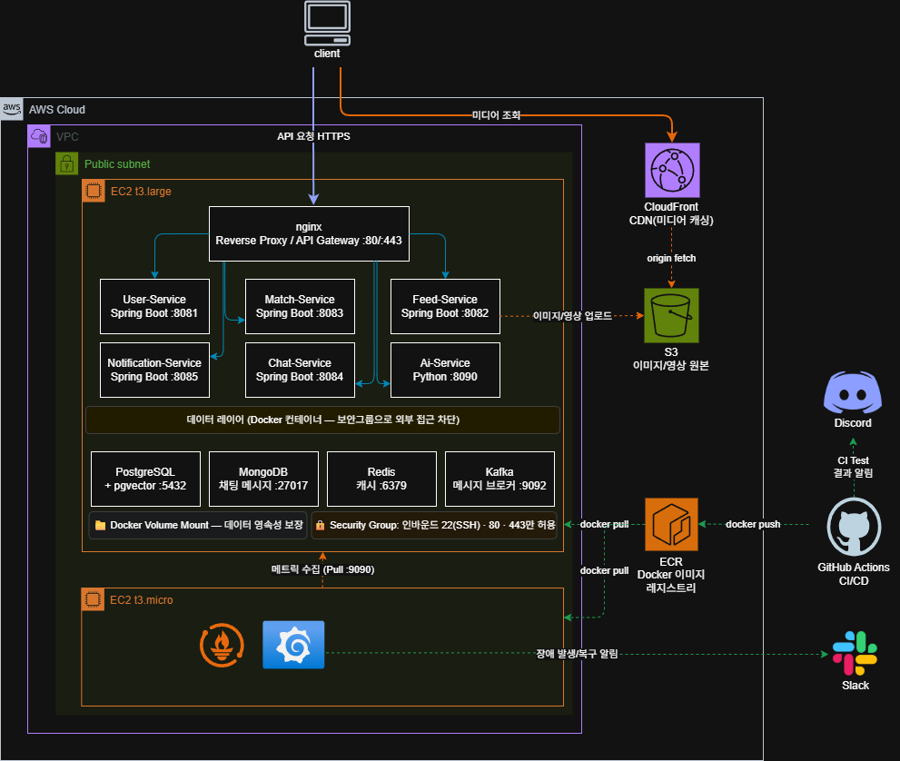
</p>

### ERD

<p align="center">
  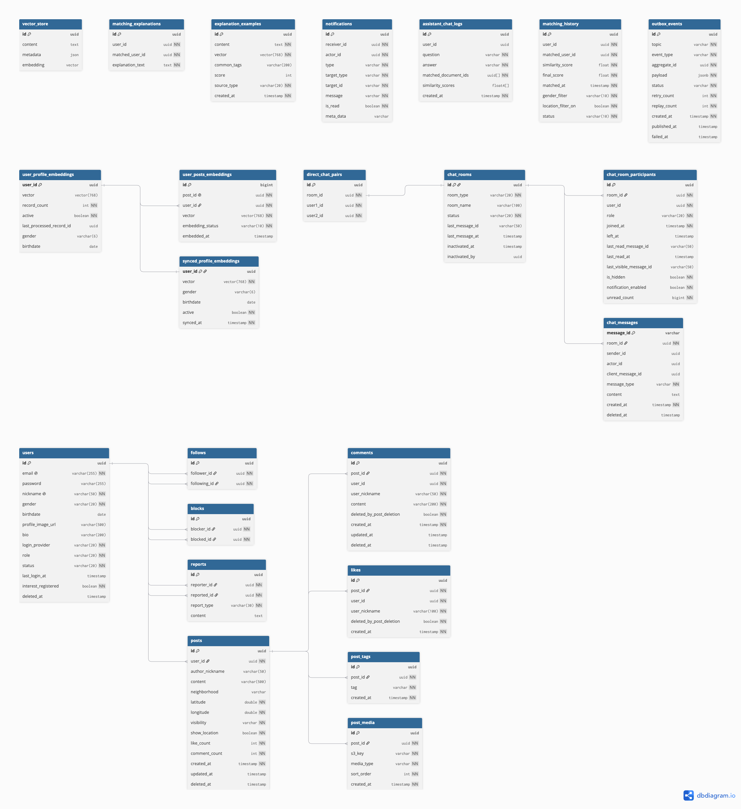
</p>

### 👣 서비스 흐름

<p align="center">
  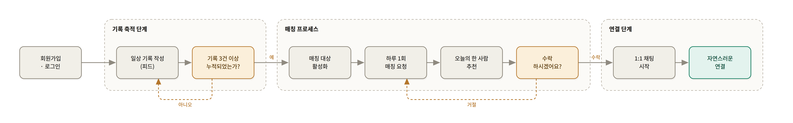
</p>

### ❤️ 매칭 흐름

<p align="center">
  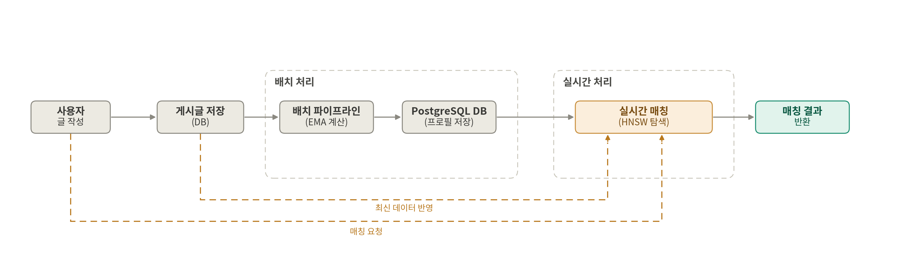
</p>

### 📸 피드 구조

<p align="center">
  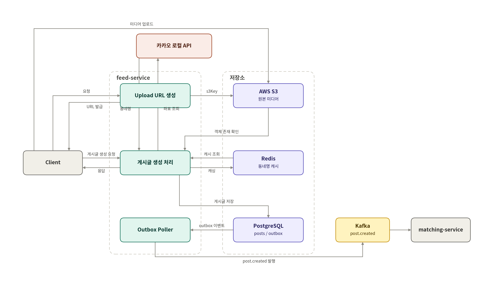
</p>

### 💬 채팅 구조

<p align="center">
  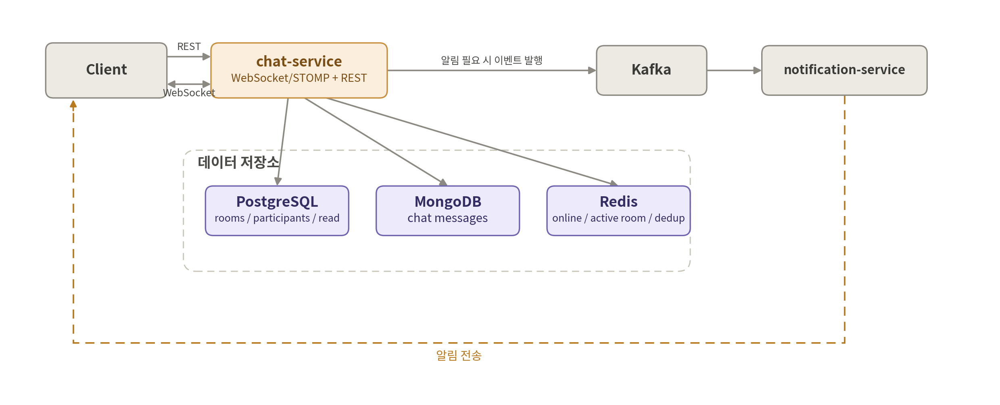
</p>

## ⚙️ 기술 스택

| 구분 | 기술 |
| --- | --- |
| Backend | Java 21, Spring Boot 3.5.15, Spring Security, Spring Cloud Gateway, Spring Data JPA, QueryDSL, OpenFeign, Resilience4j, Spring Kafka, WebSocket/STOMP, JJWT 0.12.6 |
| AI / Python | FastAPI 0.115.0, SQLAlchemy 2.0.36, pgvector 0.3.5, sentence-transformers 3.0.0, aiokafka 0.11.0, Alembic 1.13.3, Spring AI 1.0.0, Ollama/OpenAI |
| Frontend | React 19.2.7, TypeScript 5.8.3, Vite 6.3.5, Three.js 0.185.1, STOMP Client 7.3.0 |
| Database | PostgreSQL 15 + pgvector, MongoDB 7, Redis 7, Flyway, Alembic |
| Messaging | Apache Kafka 3.7.0 |
| Infra / DevOps | AWS EC2/ECR/S3/CloudFront, Docker, Docker Compose, Terraform, GitHub Actions, Prometheus/Grafana |
| Test / API | JUnit5, Testcontainers, JMeter, K6, Postman, OpenAPI, Kakao Local API |

## 🚀 배포 주소

| 구분 | 주소 |
| --- | --- |
| Web / API Gateway | 확인 필요 |
| Media CDN | https://d13u008vc7a1bl.cloudfront.net |

## 🛠️ 실행 방법

### 1. 환경 변수 준비

```bash
cp .env.example .env
```

예시:

```env
DB_USERNAME=ditto
DB_PASSWORD=ditto1234
MONGO_USERNAME=ditto
MONGO_PASSWORD=ditto1234
JWT_SECRET=your-jwt-secret-key-minimum-32-characters
LLM_API_KEY=your-llm-api-key
```

### 2. 로컬 인프라 실행

```bash
docker compose -f docker-compose.infra.yml up -d
```

실행되는 인프라:

- PostgreSQL + pgvector
- Redis
- MongoDB
- Kafka

### 3. Spring Boot 서비스 실행

```bash
./gradlew :api-gateway:bootRun
./gradlew :user_service:bootRun
./gradlew :feed_service:bootRun
./gradlew :match_service:bootRun
./gradlew :chat_service:bootRun
./gradlew :notification_service:bootRun
./gradlew :assistant_service:bootRun
```

Windows PowerShell:

```powershell
.\gradlew.bat :api-gateway:bootRun
.\gradlew.bat :user_service:bootRun
.\gradlew.bat :feed_service:bootRun
.\gradlew.bat :match_service:bootRun
.\gradlew.bat :chat_service:bootRun
.\gradlew.bat :notification_service:bootRun
.\gradlew.bat :assistant_service:bootRun
```

### 4. Embedding Service 실행

```bash
cd embedding_service
pip install -r requirements.txt
uvicorn app.main:app --host 0.0.0.0 --port 8090
```

### 5. Web 실행

`web/.env` 파일을 생성합니다.

```env
VITE_API_BASE_URL=http://localhost:8080
VITE_WS_URL=ws://localhost:8080/ws-chat
```

```bash
cd web
npm install
npm run dev
```

접속:

- Web: `http://localhost:5173`
- API Gateway: `http://localhost:8080`

주요 라우트:

| 경로 | 화면 |
| --- | --- |
| `/` | 랜딩 페이지 |
| `/login` | 로그인 |
| `/signup` | 회원가입 |
| `/app` | 대시보드(피드 / 매칭 / 채팅 / 알림 / 프로필 / 설정) |

빌드/프리뷰:

```bash
npm run build
npm run preview
```

## 📊 JMeter 부하테스트

API Gateway 기준으로 서비스별 주요 API를 JMeter로 부하 테스트하고, 병목 구간과 개선 효과를 정리했습니다.

<p align="center">
  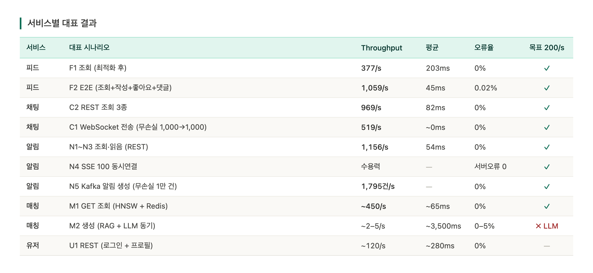
</p>

<p align="center">
  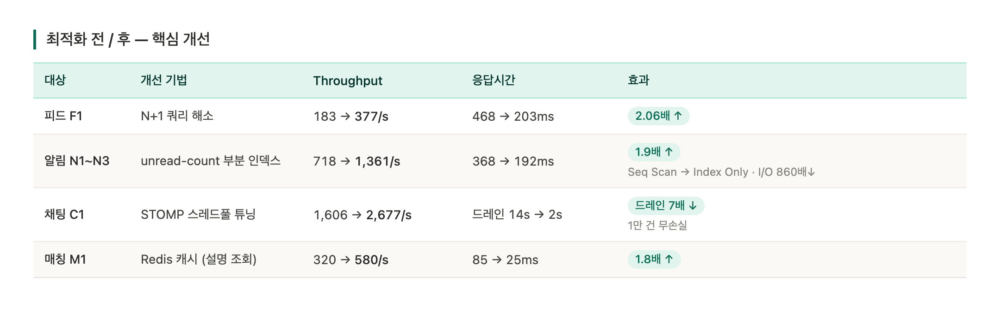
</p>

<p align="center">
  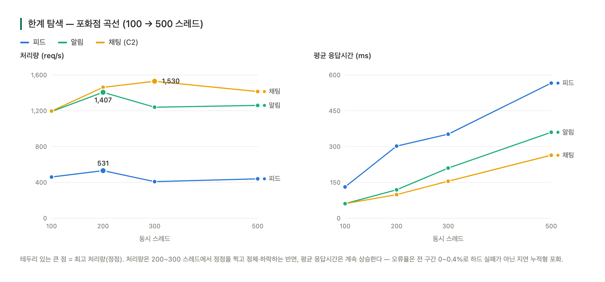
</p>

<p align="center">
  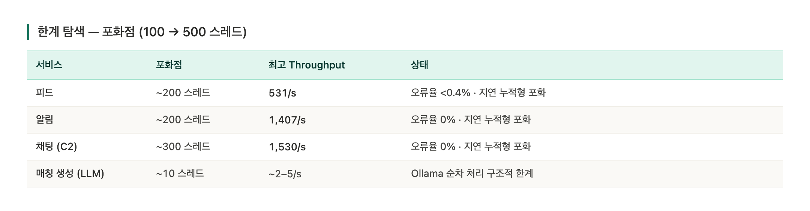
</p>

## 💬 Chat Service 성능 개선

아래 수치는 Chat Service를 로컬 Docker 인프라와 로컬 `bootRun` 환경에서 Gateway를 경유해 JMeter/K6로 측정한 결과입니다.

| 지표 | 개선 전 | 개선 후 | 결과 |
| --- | ---: | ---: | ---: |
| 방 목록 조회 평균 응답시간 | 2,641ms | 384ms | 85.5% 개선 |
| 방 목록 조회 p95 | 3,731ms | 687ms | 81.6% 개선 |
| 방 목록 조회 처리량 | 35.6/s | 217.2/s | 약 6.1배 증가 |
| 메시지 전송 p95 | 1.15s | 282ms | 약 75.5% 개선 |

주요 개선 내용:

- 방 목록 unread count를 조회 시점 MongoDB 집계에서 PostgreSQL `unread_count` Read Model로 전환
- STOMP inbound/outbound executor 튜닝
- 알림 발행을 `AFTER_COMMIT + @Async`로 응답 경로에서 분리
- Redis dedup과 MongoDB unique index로 메시지 중복 저장 방어
- lastMessage 순서 역전 방어와 읽음 처리 동시성 보강
- JMeter GUI/non-GUI, 단일 계정 100세션, K6 수신 부담 등 측정 조건을 재검증해 최종 수치 정리

## ✅ 테스트

전체 테스트:

```bash
./gradlew test
```

Windows:

```powershell
.\gradlew.bat test
```

개별 서비스 테스트 예시:

```powershell
.\gradlew.bat :chat_service:test
.\gradlew.bat :feed_service:test
.\gradlew.bat :match_service:test
```
